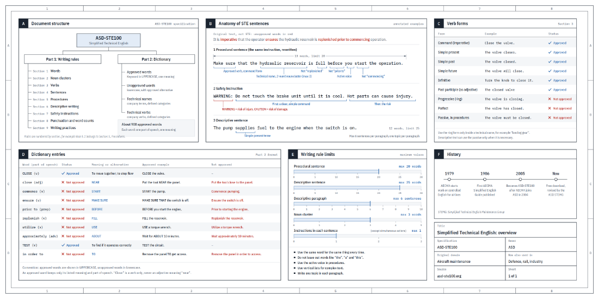

# ASD-STE100 Skill: Simplified Technical English & The Karpathy Ladder

[](LICENSE)
[](scripts/compile_prompt.py)
[](SKILL.md)
[](SKILL.md)
[](https://github.com/samirsawarkar/asd-ste100-skill/pulls)

An open-source Agent Skill and Prompt Compiler for **Claude Code**, **OpenAI Codex**, **ChatGPT**, and modern AI assistants. It implements the international **ASD-STE100 Simplified Technical English** specification and **Andrej Karpathy's Ladder of Understanding**:

1. **Controlled Writing**: ASD-STE100 (and softened 80% ASD-STE100) aerospace maintenance technical English.
2. **Visual Diagrams**: Mermaid.js and standalone SVG architecture & state flow diagrams.
3. **Interactive Web Pages**: Discardable, single-file HTML micro-simulators with reactive state boards.
4. **Bespoke Explainer Videos**: 3Blue1Brown-style Manim animations paired with synced TTS narration (free `edge-tts` / macOS `say` or ElevenLabs).

---

## The Philosophy: Cognitive Bandwidth & Discardable Software

> *"We'll be spending a lot more time trying to understand the outputs of language models. A few thoughts, tips & tricks:*  
> *Writing: Something I've had success with: Ask your LLM to explain something in **ASD-STE100**, it's a controlled language specification originally developed for aerospace maintenance documentation. LLMs well-versed in this language and it comes with heavy constraints on clean writing style that I often find a lot more readable. Sometimes I've tried to soften it a bit e.g. ask for "80% of the way to ASD-STE100" because the spec is quite stringent.*  
> *But even better: **Diagrams / images**. Instead of writing, ask your LLM to create a diagram. These can be a lot easier to process, parse, and understand.*  
> *But even better: **Web pages**. Ask for output "in HTML" to get a beautiful, interactive webpage. LLMs are getting really good at frontend and can create beautiful experiences, animations, etc.*  
> *But even better: **Explainer videos**. The output format I am most bullish on is fully custom / bespoke explainer videos generated on any arbitrary topic. Experiment with things like "Create a 3b1b style video explainer on X. Use my ElevenLabs API key for audio narration"...*  
> *In summary: As LLMs get better, they will do more and more of the legwork autonomously, and a lot more of our work will rise up the abstractions into oversight and understanding. Luckily, LLMs can help here too because as intelligence and code are increasingly abundant, you can ask for **large, custom, discardable software artifacts** (e.g. web apps, video explainers) that would have never made sense to create before. Push the boundaries here and you'll be surprised."*  
> — **[Andrej Karpathy (@karpathy)](https://x.com/karpathy)**

---

## The Four Rungs of the Ladder

```
 ▲ Rung 4: Bespoke Explainer Videos (3b1b / Manim + Synced TTS)
 │   └── Code-driven vector animation + timestamped voiceover (edge-tts / ElevenLabs).
 │
 ▲ Rung 3: Interactive Web Artifacts (Single-File HTML / Canvas / JS)
 │   └── Discardable micro-simulators: step-through state, parameter sliders, zero build.
 │
 ▲ Rung 2: Structural Visual Diagrams (Mermaid.js / Standalone SVG)
 │   └── Spatial cognition: message exchanges, state lifecycles, data topologies.
 │
 █ Rung 1: Controlled Technical English (ASD-STE100 / 80% Softened STE)
     └── Linguistic density: <=25 words/sentence, active voice, zero AI fluff.
```

---

## ASD-STE100 Specification Reference



### Hard Quantitative Constraints
| Metric | Rule Limit | STE Requirement |
| :--- | :--- | :--- |
| **Procedural sentence** | **Max 20 words** | Action/instruction steps. |
| **Descriptive sentence** | **Max 25 words** | Conceptual, explanatory, or factual text. |
| **Descriptive paragraph** | **Max 6 sentences** | Exactly one topic per paragraph. |
| **Noun cluster** | **Max 3 words** | Maximum 3 nouns strung together (e.g., `memory buffer pool`). |
| **Instructions per sentence** | **Max 1 instruction** | Unless two actions are strictly simultaneous. |

### Verb Form Rules
- **Approved**: Imperative Command (`Close the valve`), Simple Present (`The valve closes`), Simple Past (`The valve closed`), Simple Future (`The valve will close`), Infinitive (`Turn knob to close`), Past Participle as adjective (`The closed valve`).
- **NOT Approved**: Progressive (`-ing` forms e.g. *is closing*), Perfect tenses (*has closed*), Passive voice in procedures (*the valve must be closed* $\rightarrow$ *Close the valve*).

### Common Vocabulary Substitutions
| Unapproved Word | Approved STE Alternative |
| :--- | :--- |
| `ensure` | **MAKE SURE** |
| `prior to` | **BEFORE** |
| `replenish` | **FILL** |
| `utilize` | **USE** |
| `commence` | **START** |
| `approximately` | **ABOUT** |
| `in order to` | **TO** |
| `terminate` | **STOP / END** |
| `modify` | **CHANGE** |
| `obtain` | **GET** |

### The "80% ASD-STE100" Softening
For computer science, distributed systems, and modern engineering:
- Preserves all structural bounds: $\le 20\text{--}25$ words per sentence, active voice, simple tenses, plain verbs.
- Strictly bans AI filler buzzwords: *delve, leverage, tapestry, seamless, revolutionize, testament, beacon, cutting-edge, holistic, game-changer*.
- Softened boundary: Permits standard domain terminology (*idempotency, mutex, raft, sharding, backpressure*).

---

## Installation

### Option 1: Quick Install via skills.sh CLI
```bash
npx skills add samirsawarkar/asd-ste100-skill
```

### Option 2: Clone for Claude Code & OpenAI Codex
```bash
# Clone to global skills folder
git clone https://github.com/samirsawarkar/asd-ste100-skill ~/.claude/skills/asd-ste100

# For OpenAI Codex:
git clone https://github.com/samirsawarkar/asd-ste100-skill ~/.codex/skills/asd-ste100
```

### Option 3: Per-Project Symlink
```bash
# In your project root:
mkdir -p .claude/skills .codex/skills .agents/skills
ln -s /path/to/asd-ste100-skill .claude/skills/asd-ste100
ln -s /path/to/asd-ste100-skill .codex/skills/asd-ste100
ln -s /path/to/asd-ste100-skill .agents/skills/asd-ste100
```

---

## CLI Usage: `compile_prompt.py`

A zero-dependency, standard-library Python utility included in the repository.

### 1. Compile Normal Prompts to Karpathy-Tier Prompts
```bash
# Generate complete 4-tier prompt package
python3 scripts/compile_prompt.py "Explain Raft consensus leader election"

# Generate 80% ASD-STE100 controlled English prompt
python3 scripts/compile_prompt.py --tier 80-ste100 "Explain PostgreSQL WAL"

# Generate interactive single-file HTML sandbox prompt
python3 scripts/compile_prompt.py --tier html "Explain B-Tree node splitting"

# Generate 3b1b Manim video explainer with free local compute TTS
python3 scripts/compile_prompt.py --tier video --tts edge-tts "Explain the Fourier Transform"
```

### 2. Built-in ASD-STE100 Linter
Audit existing text or LLM responses against the STE-100 specification:
```bash
python3 scripts/compile_prompt.py --lint "The operator is running tests to ensure that the engine operates smoothly prior to commencing the flight."
```
Output:
```text
=== ASD-STE100 Lint Report (Score: 70/100) ===
Total Sentences: 1 | Total Issues: 3

[UNAPPROVED_WORD] Sentence 1: Unapproved word 'ensure' found. Replace with 'make sure'.
[UNAPPROVED_WORD] Sentence 1: Unapproved word 'prior to' found. Replace with 'before'.
[PROGRESSIVE_TENSE] Sentence 1: Progressive verb form 'running' is not approved. Use simple present or past.
```

---

## Testing

Run the included assert-based test suite (zero third-party dependencies required):
```bash
python3 tests/test_compiler.py
# Output: ALL TESTS PASSED: compile_prompt and STE-100 validator verified successfully.
```

---

## Repository Structure

```
asd-ste100-skill/
├── SKILL.md                          # Master Agent Skill specification
├── README.md                         # Documentation & reference guide
├── LICENSE                           # MIT License
├── assets/
│   └── asd-ste100-cheatsheet.png     # Full-resolution STE specification sheet
├── scripts/
│   └── compile_prompt.py             # CLI prompt compiler & STE-100 linter
├── references/
│   ├── asd-ste100-cheatsheet.md      # Comprehensive rules, grammar & dictionary
│   ├── karpathy-ladder.md            # The Ladder of Understanding conceptual guide
│   └── examples.md                   # Full before & after end-to-end demonstrations
└── tests/
    └── test_compiler.py              # Self-check test suite
```

---

## Author & Acknowledgments

- **Concept**: Inspired by [Andrej Karpathy's thoughts on LLM outputs and discardable software artifacts](https://x.com/karpathy).
- **Implementation**: Created by [Samir Sawarkar](https://github.com/samirsawarkar).
- **License**: [MIT](LICENSE). Contributions, PRs, and improvements are welcome!
