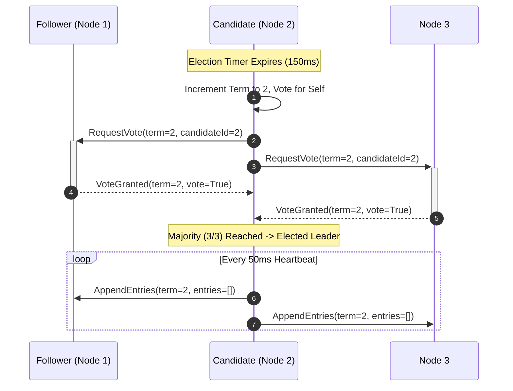

# Karpathy Explainer: End-to-End Examples

This document demonstrates how `karpathy-explainer` transforms vague, conversational prompts into high-bandwidth understanding artifacts.

---

## Example 1: Prompt Transformation (Mode 1 — Meta-Prompting)

### Raw User Prompt
> *"Can you explain how Raft consensus works, especially leader election and log replication?"*

### Compiled Output (Karpathy High-Bandwidth Package)

```markdown
# Topic: Raft Consensus Algorithm (Leader Election and Log Replication)

Execute Karpathy's Ladder of Understanding to provide maximum cognitive bandwidth:

## Rung 1: Controlled Technical Summary (80% ASD-STE100)
Explain Raft using 80% ASD-STE100:
- Sentence length: Procedural <= 20 words, Descriptive <= 25 words.
- Active voice imperative ('Start election timer', 'Send heartbeat RPC').
- Simple tenses only (Simple Present, Simple Past, Simple Future).
- Zero AI buzzwords (no 'delve', 'leverage', 'tapestry', 'seamless').
- Plain verbs ('make sure' instead of 'ensure', 'before' instead of 'prior to').
- Max 6 sentences per paragraph. Vertical lists for sequential steps.

## Rung 2: Structural Diagrams (Mermaid.js)
1. Sequence Diagram: Show Follower timeout -> Candidate RequestVote -> Leader AppendEntries heartbeat loop.
2. State Machine Diagram: Show Follower <-> Candidate -> Leader state transitions.
3. Invariants Table: [State | Role | Invariants].

## Rung 3: Discardable Interactive Web Artifact
Provide a standalone single-file `raft_explainer.html`:
- Pure HTML5 + CSS + vanilla JavaScript. Zero build steps.
- Interactive controls: [Step Back], [Step Forward], [Auto-Play], [Trigger Network Partition].
- SVG cluster canvas showing 5 nodes (Follower, Candidate, Leader).
- State inspector pane showing Term, VotedFor, and CommitIndex.

## Rung 4: 3b1b Video Explainer & Synced TTS
1. Manim CE Script (`scene.py`):
   - High-contrast vector animations of nodes sending vote ballots.
2. Timestamped Voiceover Transcript (`voiceover.md`):
   - Timed cues matching scene durations.
3. Free Audio Pipeline (`narrate.sh`):
   - Shell command using `edge-tts --voice en-US-ChristopherNeural` to render narration.
   - FFmpeg mux command to assemble final MP4.
```

---

## Example 2: Direct Execution Output (Mode 2)

### Rung 1: Controlled Technical Prose (80% ASD-STE100)

**1. Executive Definition**
> Raft is a consensus algorithm for replicated state machines. It elects one leader to manage all log replication across a cluster.

**2. Core Mechanism: Leader Election**
1. Each follower node starts an election countdown timer.
2. If the timer expires without a leader heartbeat, the node becomes a candidate.
3. The candidate increments the current term number.
4. The candidate votes for itself.
5. The candidate sends `RequestVote` RPCs to all other nodes.
6. If a majority of nodes grant their vote, the candidate becomes the leader.
7. The new leader sends empty `AppendEntries` heartbeats to prevent new elections.

**3. Safety Guarantees**
- **Election Safety**: At most one leader can be elected in a given term.
- **Leader Append-Only**: A leader never overwrites or truncates its own log entries.
- **Log Matching**: If two logs share an entry with the same index and term, they are identical up to that index.

**4. Failure Scenarios**
> **WARNING**: Do not set identical election timeouts across nodes. Split votes can stall leader election indefinitely.

---

## Example 3: Rung 2 Diagram (Mermaid)


